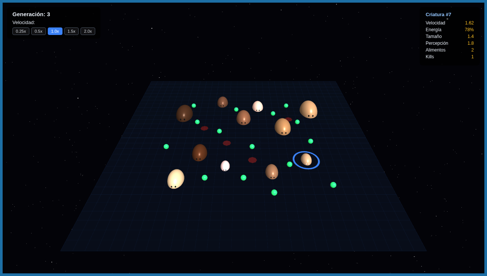

<a id="readme-top"></a>


<p align="center">
  &nbsp;
  &nbsp;
  &nbsp;
  &nbsp;
</p>

<br>

<div align="center">
  
  <h3 align="center">SPADE Natural Selection Simulator</h3>
  <p align="center">
    Simulación multi-agente de selección natural con comportamientos emergentes. Agentes SPADE en Python, comunicación XMPP y visualización 3D en tiempo real con Three.js.
    <br>
    <a href="https://github.com/hexed-AAL1X/SPADE-NaturalSelectionSimulator"><strong>Explorar repositorio »</strong></a>
    <br><br>
    <a href="https://github.com/hexed-AAL1X/SPADE-NaturalSelectionSimulator">Ver código</a>
    ·
    <a href="https://github.com/hexed-AAL1X/SPADE-NaturalSelectionSimulator/issues/new?labels=bug">Reportar bug</a>
    ·
    <a href="https://github.com/hexed-AAL1X/SPADE-NaturalSelectionSimulator/issues/new?labels=enhancement">Pedir feature</a>
  </p>
</div>

<details>
  <summary>Tabla de contenidos</summary>
  <ol>
    <li><a href="#about-the-project">About the project</a></li>
    <li><a href="#built-with">Built with</a></li>
    <li><a href="#important-notices">Important notices</a></li>
    <li>
      <a href="#getting-started">Getting started</a>
      <ul>
        <li><a href="#prerequisites">Prerequisites</a></li>
        <li><a href="#installation">Installation</a></li>
        <li><a href="#available-scripts">Available scripts</a></li>
      </ul>
    </li>
    <li>
      <a href="#contributing">Contributing</a>
      <ul>
        <li><a href="#top-contributors">Top contributors</a></li>
      </ul>
    </li>
    <li><a href="#contact">Contact</a></li>
  </ol>
</details>
<br>

<a id="about-the-project"></a>***About the project***


<p align="center">
  
</p>

Este proyecto implementa una **simulación de selección natural y comportamientos emergentes** usando agentes autónomos con SPADE (Smart Python Agent Development Environment).

El ecosistema simula criaturas que operan de forma independiente con:

- **Satisfacción basada en objetivos**: las criaturas buscan alimento hasta alcanzar su meta.
- **Modo supervivencia**: cuando la energía cae al 35%, reducen su objetivo de 2 a 1 alimento.
- **Retorno al hogar**: las criaturas satisfechas regresan a su spawn sin gastar energía.
- **Herencia genética**: velocidad, tamaño y percepción se transmiten entre generaciones.
- **Visualización 3D**: interfaz web con Three.js, blobs orgánicos animados y gráficos en tiempo real.

<p align="right">(<a href="#readme-top">back to top</a>)</p>

<a id="built-with"></a>***Built with***


- 
- 
- 
- 
- 
- 

<p align="right">(<a href="#readme-top">back to top</a>)</p>

<a id="important-notices"></a>***Important notices***


> [!NOTE]
> Se requiere un servidor XMPP activo (ej. [Prosody](https://prosody.im/)) para que los agentes SPADE puedan comunicarse.

> [!IMPORTANT]
> Ejecutar `hostAgent.py` es suficiente para arrancar toda la simulación. Lanza automáticamente `GenerationAgent` y la interfaz web en el puerto `10000`.

> [!WARNING]
> Los archivos CSV (`generation_summary.csv`, `generation_details.csv`, `predation_events.csv`) se limpian automáticamente al inicio de cada ejecución.

<p align="right">(<a href="#readme-top">back to top</a>)</p>

<a id="getting-started"></a>***Getting started***

<a id="prerequisites"></a>

### Prerequisites

- Python 3.10+
- pip
- Servidor XMPP activo (Prosody, ejabberd, etc.)

<a id="installation"></a>

### Installation

1) Clonar el repositorio

```bash
git clone https://github.com/hexed-AAL1X/SPADE-NaturalSelectionSimulator.git
cd SPADE-NaturalSelectionSimulator
```

2) Crear y activar entorno virtual

```bash
python -m venv venv
# Windows
venv\Scripts\activate
# Linux / macOS
source venv/bin/activate
```

3) Instalar dependencias

```bash
pip install spade aiohttp
```

4) Ejecutar la simulación

```bash
python hostAgent.py
```

5) Abrir la interfaz web

- `http://localhost:10000/static/index.html`

<a id="available-scripts"></a>

### Available scripts

```bash
python hostAgent.py        # Lanza toda la simulación + UI web
python generationAgent.py  # Solo el motor de generaciones (avanzado)
```

**Controles de velocidad en la UI:**

| Botón | Velocidad |
|-------|-----------|
| 0.25x | Cámara lenta |
| 0.5x  | Lento |
| 1.0x  | Normal |
| 1.5x  | Rápido |
| 2.0x  | Fast forward |

<p align="right">(<a href="#readme-top">back to top</a>)</p>

<a id="contributing"></a>***Contributing***


Contribuciones bienvenidas.

1) Fork del proyecto
2) Crear una rama (`git checkout -b feature/nueva-feature`)
3) Commit (`git commit -m "Add: ..."`)
4) Push (`git push origin feature/nueva-feature`)
5) Pull Request

<a id="top-contributors"></a>

### Top contributors

<div align="center">

<table>
  <tr>
    <td align="center" width="160">
      <a href="https://github.com/coshiiiiiiiiii">
        <br />
        <b>Ariana Quelopana Puppo</b><br />
        <sub>@coshiiiiiiiiii</sub>
      </a>
    </td>
    <td align="center" width="160">
      <a href="https://github.com/tsavorae">
        <br />
        <b>tera</b><br />
        <sub>@tsavorae</sub>
      </a>
    </td>
    <td align="center" width="160">
      <a href="https://github.com/LiamQuinoNeff">
        <br />
        <b>Liam Quino Neff</b><br />
        <sub>@LiamQuinoNeff</sub>
      </a>
    </td>
  </tr>
</table>

</div>

<p align="right">(<a href="#readme-top">back to top</a>)</p>

<a id="contact"></a>***Contact***


<p align="center">
  <a href="mailto:hexed_aal1x.ops@proton.me"></a>
  <a href="https://www.instagram.com/hexed_aal1x"></a>
  <a href="https://www.linkedin.com/in/leonardo-bravo-4120b8228/"></a>
</p>

<p align="right">(<a href="#readme-top">back to top</a>)</p>
